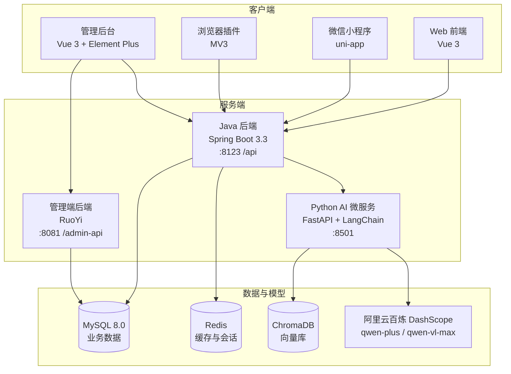

# 反诈大师 Anti-Fraud Master


基于 **Spring Boot 3 + LangChain + 通义千问** 的多模态 AI 反诈智能体。支持文字 / 图片 / 视频风险识别、RAG 知识库问答、四级风险评估与 AI 劝阻话术生成，已覆盖 **Web、微信小程序、浏览器插件、管理后台** 四端。

> ## 免责声明
>
> 本项目为**技术学习与研究用途**的开源项目。
>
> - AI 分析结果仅供参考，**不构成任何专业法律或安全建议**；
> - 是否遭遇诈骗，**请以公安机关认定为准**；
> - 如遇疑似诈骗，请立即拨打 **96110**（反诈专线）或 **110** 报警；
> - 请勿将本项目用于任何违反法律法规的用途。

---

## 目录

- [项目背景](#项目背景)
- [核心功能](#核心功能)
- [系统架构](#系统架构)
- [技术栈](#技术栈)
- [目录结构](#目录结构)
- [快速开始](#快速开始)
- [环境变量](#环境变量)
- [API 接口](#api-接口)
- [常见问题](#常见问题)
- [安全提示](#安全提示)
- [许可证与致谢](#许可证与致谢)

---

## 项目背景

传统反诈工具多基于**黑名单库 + 关键词规则匹配**，面对不断演化的话术（尤其是复合式诈骗、AI 换脸 / 语音克隆等新型手段）存在明显滞后性。本项目尝试用大模型语义理解补上这一环：

- **理解隐晦话术**：不依赖关键词命中，基于语义判断诈骗意图；
- **多模态取证**：直接上传聊天截图、视频，由视觉模型完成 OCR 与内容理解；
- **不止于判定**：输出可保存的风险报告 + 可直接照读的劝阻话术，形成"识别 → 报告 → 劝阻"闭环。

---

## 核心功能

### 1. 多模态风险识别

| 输入 | 能力 | 模型 |
|------|------|------|
| 文本 | 自然语言描述遭遇，判定诈骗类型与风险等级 | `qwen-plus` |
| 图片 | 聊天记录 / 短信截图 OCR + 场景理解 | `qwen-vl-max` |
| 视频 | 视频内容抽帧分析 | `qwen-vl-max` |

### 2. 对话三模式

系统自动路由到三种对话模式：

- **闲聊模式** —— 日常交流，口语化回复
- **咨询模式** —— 反诈知识科普，基于 RAG 知识库精准作答
- **反诈预警模式** —— 个人遭遇分析，输出结构化四段式回复

### 3. 风险评估与画像

- 四级风险等级：**低 / 中 / 高 / 极高**
- 多维度加权评分：年龄身份、联系方式、文本内容、历史查询、行为习惯
- 五类人群差异化规则：财会人员、自由职业者、老人、青年、少儿

### 4. AI 劝阻话术生成

当风险等级判定为 **高 / 极高** 时自动触发，按诈骗类型 + 用户画像生成口语化劝阻话术（例如"冒充公检法 + 老年"与"刷单返利 + 青年"话术完全不同）。

### 5. 风险报告导出

生成结构化反诈报告，支持 **PDF** 与 **图片** 两种格式下载，包含风险项明细、防骗建议、报警维权指引。

### 6. 业务闭环

- **历史记录**：检测记录留存、搜索筛选、收藏标记
- **黑名单**：可疑号码 / 账号 / 网址标记
- **举报上报**：一键提交可疑信息，进入举报队列并关联历史举报

---

## 系统架构



**分工原则**：Java 负责主业务逻辑、认证与 API 编排；Python 承载 AI/ML 密集型任务（大模型推理、文本向量化、风险画像计算、报告渲染、爬虫调度）。两者通过 REST + JSON 通信。

---

## 技术栈

### 后端

| 技术 | 版本 | 说明 |
|------|------|------|
| Spring Boot | 3.3.3 | Java 主框架 |
| JDK | 17 | 运行环境 |
| Python | 3.10 | AI 微服务 |
| FastAPI | 0.100+ | Python Web 框架 |
| LangChain | 0.3+ | AI 应用编排 |
| MySQL | 8.0.24 | 业务数据存储 |
| Redis | — | 缓存与会话 |
| ChromaDB | 0.4+ | 向量存储 |
| MyBatis | — | 管理端 ORM |

### 前端

| 端 | 技术 |
|----|------|
| C 端 Web | Vue 3 + Vite 4 + Vue Router |
| 管理后台 | Vue 3 + Element Plus + ECharts + Vite |
| 微信小程序 | uni-app |
| 浏览器插件 | Chrome Extension Manifest V3 |

### AI 模型（阿里云百炼 DashScope）

| 模型 | 用途 |
|------|------|
| `qwen-plus` | 对话生成与推理 |
| `qwen-vl-max` | 图片 / 视频理解与 OCR |
| `text-embedding-v2` | 文本向量化 |

---

## 目录结构

```
Anti-FraudAgent/
├── sql/                              # 数据库初始化脚本
│   ├── 01-schema.sql                 # 业务核心表
│   └── 02-admin-init.sql             # 管理后台菜单与角色初始化
├── python_services/                  # Python AI 微服务
│   └── app/
│       ├── api/                      # FastAPI 路由
│       ├── risk_engine/              # 风险评分引擎
│       ├── report/                   # 报告生成（PDF / 图片）
│       ├── nlp/                      # 诈骗分类、劝导话术
│       ├── vector_store/             # 向量化与检索
│       ├── crawler/                  # 案例爬虫
│       ├── notification/             # 通知推送
│       └── metrics/                  # 指标统计
└── antiFraud-ai-agent-main/
    └── antiFraud-ai-agent/
        ├── src/                      # Java 主后端（:8123 /api）
        ├── antiFraud-admin/          # 管理端后端（:8081 /admin-api）
        ├── antiFraud-ai-agent-fronted/       # C 端 Web 前端（:5173）
        ├── antiFraud-ai-agent-admin-fronted/ # 管理后台前端（:5174）
        ├── antiFraud-ai-agent-miniapp/       # 微信小程序（uni-app）
        └── browser-plugin/           # 浏览器插件（MV3）
```

---

## 快速开始

### 环境要求

- JDK 17+
- Python 3.10+
- Node.js 18+
- Maven 3.6+
- MySQL 8.0+
- Redis

### 1. 初始化数据库

管理端基于 **RuoYi** 构建，因此需先导入 RuoYi 基础表，再导入本项目脚本：

```bash
# 顺序不可颠倒
mysql -u root -p < ry_20260417.sql        # ① RuoYi 官方基础表
mysql -u root -p < sql/01-schema.sql      # ② 本项目业务表
mysql -u root -p < sql/02-admin-init.sql  # ③ 管理菜单与角色
```

> RuoYi 官方脚本获取：<https://gitee.com/y_project/RuoYi-Vue> 或 <https://github.com/yangzongzhuan/RuoYi-Vue>

### 2. 配置环境变量

**Python 微服务**（`python_services/.env`）：

```env
DASHSCOPE_API_KEY=your-dashscope-api-key
```

**Java 后端**（环境变量或 `application-local.yml`）：

```bash
export DB_USERNAME=root
export DB_PASSWORD=your-password
export JWT_SECRET=your-jwt-secret
```

### 3. 启动 Python AI 微服务

```bash
cd python_services
pip install -r requirements.txt
uvicorn app.main:app --host 0.0.0.0 --port 8501
```

### 4. 启动 Java 后端

```bash
cd antiFraud-ai-agent-main/antiFraud-ai-agent
mvn spring-boot:run
```

主后端监听 `http://localhost:8123/api`

### 5. 启动前端

```bash
# C 端 Web（默认 :5173）
cd antiFraud-ai-agent-main/antiFraud-ai-agent/antiFraud-ai-agent-fronted
npm install && npm run dev

# 管理后台（:5174）
cd antiFraud-ai-agent-main/antiFraud-ai-agent/antiFraud-ai-agent-admin-fronted
npm install && npm run dev
```

小程序与浏览器插件：用 HBuilderX / 微信开发者工具打开 `antiFraud-ai-agent-miniapp`；浏览器插件在 Chrome 开发者模式下"加载已解压的扩展程序"并选择 `browser-plugin` 目录。

### 服务端口一览

| 服务 | 端口 | 路径前缀 |
|------|------|----------|
| Java 主后端 | 8123 | `/api` |
| 管理端后端 | 8081 | `/admin-api` |
| Python AI 微服务 | 8501 | `/` |
| C 端 Web 前端 | 5173 | — |
| 管理后台前端 | 5174 | — |

---

## 环境变量

| 变量 | 服务 | 说明 | 默认值 |
|------|------|------|--------|
| `DASHSCOPE_API_KEY` | Python | 阿里云百炼 API Key（**必填**） | — |
| `LLM_CHAT_MODEL` | Python | 对话模型 | `qwen-plus` |
| `LLM_VISION_MODEL` | Python | 视觉模型 | `qwen-vl-max` |
| `LLM_EMBEDDING_MODEL` | Python | 向量化模型 | `text-embedding-v2` |
| `LLM_TEMPERATURE` | Python | 采样温度 | — |
| `LLM_MAX_TOKENS` | Python | 最大生成长度 | — |
| `DB_USERNAME` | Java | 数据库用户名 | `root` |
| `DB_PASSWORD` | Java | 数据库密码 | `changeme` |
| `JWT_SECRET` | Java | JWT 签名密钥（**生产必改**） | `changeme-...` |

> **提示**：Python 侧优先读取 `DASHSCOPE_API_KEY`，未设置时回退读取 `DASH_SCOPE_API_KEY`（带下划线），两种写法均兼容。

---

## API 接口

基础路径：`http://localhost:8123/api`

### AI 能力

```
POST /ai/love_app/chat/sync     # 同步对话
POST /ai/love_app/chat/tools    # 带工具调用对话
POST /ai/love_app/chat/report   # 报告生成对话
POST /ai/love_app/clear         # 清空会话记忆
POST /ai/vision/analyze         # 图片分析（OCR + 风险识别）
POST /ai/check-video            # 视频分析（multipart）
POST /ai/rag/chat               # RAG 知识库问答
GET  /ai/stats                  # 统计信息
```

### 业务功能

```
GET    /history/list            # 检测历史列表
POST   /history/favorite        # 收藏 / 取消收藏
DELETE /history/{historyId}     # 删除记录

POST   /persuasion/generate     # 生成劝阻话术

POST   /report/submit           # 提交举报
GET    /report/pdf/{reportId}   # 导出 PDF 报告
GET    /report/image/{reportId} # 导出图片报告

GET    /blacklist/list          # 黑名单列表
POST   /blacklist/add           # 加入黑名单
DELETE /blacklist/remove        # 移出黑名单
```

### 认证与健康检查

```
POST /v1/auth/login             # 登录
POST /v1/auth/register          # 注册
GET  /v1/auth/captchaImage      # 验证码
GET  /health                    # 健康检查
```

> 启动后可访问 Swagger 查看完整接口：`http://localhost:8123/api/swagger-ui.html`

---

## 常见问题

**Q：启动时报 `Table 'anti_fraud.xxx' doesn't exist`？**

A：未按顺序导入数据库脚本。项目关闭了 JPA 自动建表（`ddl-auto: none`），必须手动执行 `sql/` 下的脚本，详见[初始化数据库](#1-初始化数据库)。

**Q：AI 接口返回鉴权失败？**

A：确认 `.env` 中已填写 `DASHSCOPE_API_KEY`（代码同时兼容 `DASH_SCOPE_API_KEY` 写法），并确认该 Key 已开通百炼服务。

**Q：管理后台菜单为空？**

A：`02-admin-init.sql` 未执行，或执行顺序在 RuoYi 脚本之前。菜单 ID 从 2001 起，脚本使用 `INSERT IGNORE`，可重复执行而不会产生重复数据。

---

## 安全提示

部署到公网前请务必完成以下配置：

1. **修改所有默认密码** —— `sql/` 脚本中的 BCrypt 哈希为 RuoYi 出厂默认值（明文 `admin123`），仅限本地调试；
2. **设置强 JWT 密钥** —— 通过 `JWT_SECRET` 环境变量注入，勿使用默认值；
3. **不要提交密钥文件** —— 仓库已通过 `.gitignore` 排除 `.env`、`application-local.yml` 等，请勿强制添加；
4. **收紧 CORS 来源** —— Python 微服务当前为 `allow_origins=["*"]`，生产环境需按域名限制。

---

## 许可证与致谢

本项目采用 [MIT License](LICENSE) 开源。

- [RuoYi-Vue](https://gitee.com/y_project/RuoYi-Vue) —— 管理后台基于其架构改造（MIT License）
- [LangChain](https://github.com/langchain-ai/langchain) —— AI 应用编排框架
- [阿里云百炼](https://bailian.console.aliyun.com/) —— 大模型能力支持

如本项目对你有帮助，欢迎点个 Star。
